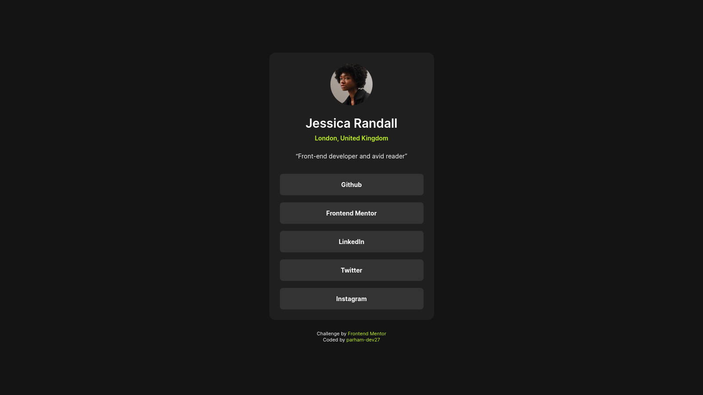

</img>

<h1 align="center">Social Links Profile</h1>

  <h3>
    <a href="https://parham-dev27.github.io/Social Links Profile" color="white">
      Live
    </a>
     | 
    <a href="#Solution">
      Solution
    </a>
    | 
    <a href="#Challenge">
      Challenge
    </a>
  </h3>

   Solution for a challenge from  <a href="https://www.frontendmentor.io/" target="_blank">frontendmentor.io</a>.

 
 

## About The Project

This challenge will serve as excellent practice for individuals seeking to test their CSS skills. Flexbox is an incredibly potent extension of CSS, making it highly valuable to familiarize oneself with it. The primary objective of this challenge is to construct and to achieve a design that closely resembles the provided design. You are free to utilize any tools that aid you in completing the challenge. Therefore, if there's a particular skill you wish to enhance, feel encouraged to give it a try.
 
  
I do not have access to the Figma sketch so the design is not pixel perfect.

## Built with

-   Semantic HTML5 markup
-   Flex / Grid
-   Desktop-first workflow
-   Responsive Design
-   Media queries

## What I learned

Another great project to practice CSS. I finally had a better understanding of CSS and learned how to make a responsive design with media queries and flex-boxes. Really loved the project!

## Acknowledgments

A big thank you to anyone providing feedback on my <a href="#Solution">solution</a>. It definitely helps to find new ways to code and find easier solutions!
